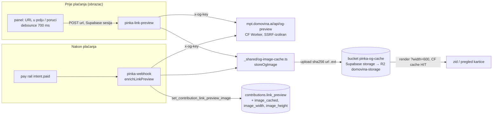

# OG slike link previewa — keširanje u `pinka-og-cache` (28.9.2026.)

Zid podrške (domovina.ai `/c/:slug/doniraj`, `/v/:id/doniraj`) do ovog datuma
nije crtao `link_preview.image`: `Image.network` na tuđi host odao bi IP svakog
posjetitelja zida vlasniku tog hosta (odluka iz
`pay.domovina.ai/backend/src/og/preview.ts`). Sada sliku dohvaća NAŠ server,
jednom po poveznici, i sprema je kod nas.

## Tok



- Ključ objekta je `sha256(izvorni image URL).<ext>`, pa preview u obrascu i
  webhook nakon plaćanja pišu **isti** objekt (provjereno: ff.hr → `11dc02…`).
- `image_cached` = `https://api.domovina.ai/storage/v1/render/image/public/pinka-og-cache/<hash>.<ext>?width=600&quality=80`.
- Tuđi `image` URL ostaje u bazi kao podatak, ali ga `pinka-link-preview` ne
  vraća, a klijent ga ne crta (model prihvaća `image_cached` samo s `https://api.domovina.ai`).

## Obrana od SSRF-a (`_shared/og-image-cache.ts`)

Funkcije rade na Coolify hostu, odakle su dosežni interni servisi (kong,
imgproxy, db), pa je SSRF stvaran. Pravila: samo https i port 443, bez
korisnika u URL-u, host nije IP literal/`localhost`/jednodijelno ime, **sve**
A/AAAA adrese (DoH preko cloudflare-dns.com) moraju biti javne, redirecti ručno
(≤ 3, svaki hop ista provjera), samo `image/{jpeg,png,webp,gif,avif}` (SVG
nikad), ≤ 2 MB, 4 s. Provjereno i na `localtest.me` (javno ime → 127.0.0.1).
Preostali rizik: DNS rebinding između DoH i fetcha, uz https-only malo vjerojatan.

## Storage = R2 (provjereno 28.9.2026.)

- Živi `supabase-storage` container: `STORAGE_BACKEND=s3`, endpoint
  `https://7dc7167b….r2.cloudflarestorage.com`, bucket `domovina-storage`
  (prebačeno `scripts/storage-r2-switch.sh`). Wrangler: isti objekt, custom
  domena `s.domovina.ai` aktivna, r2.dev ugašen.
- **`s.domovina.ai` nije upotrebljiv javni URL**: ključ je
  `storage-single-tenant/<bucket>/<path>/<version-uuid>` — bez verzije 404, a
  verzija se mijenja svakim uploadom. Usput: preko `s.domovina.ai` je čitljiv i
  objekt iz *privatnog* bucketa ako se zna verzija (UUID, pa nizak rizik).
- `api.domovina.ai` render URL **jest** CDN-keširan: prvi zahtjev `MISS`, zatim
  `HIT`, `cache-control: max-age=31536000`, `Vary: Accept-Encoding` (bez
  `Origin` varijante). imgproxy (`ENABLE_IMAGE_TRANSFORMATION=true`) renderira
  jednom po URL-u.

## Zamke

- **`STORAGE_PUBLIC_URL` u edge containeru je `http://api.domovina.ai`** (postavlja
  ga Coolify). Prvih 8 `image_cached` URL-ova je zato ispalo na http; funkcija
  sada čita `PINKA_OG_PUBLIC_BASE` (default `https://api.domovina.ai`).
- Cloudflare odbija Python `urllib` user-agent (error 1010) — skripte šalju svoj UA.
- `db-migrate.sh` bi povukao i dvije starije, namjerno neprimijenjene migracije
  (`20260903120000_events_publish_rail_gate`, `20260903120100_events_rotate_ticket_tokens`).
  Migracije ove teme su primijenjene pojedinačno (psql u transakciji + red u
  `supabase_migrations.schema_migrations`). Zašto te dvije stoje — nije
  istraženo.

## Dimenzije i omjer

Zid bira raspored PRIJE učitavanja slike (visina pločice), pa se pri keširanju
iz zaglavlja PNG/JPEG/GIF/WebP čitaju `image_width`/`image_height`
(`imageSize`, bez dekodiranja; AVIF → null). Izmjereno na 8 postojećih slika:
samo 3 su 1200×630; ostale 1920×711, 1748×1240, 2560×1441, 943×2000, 211×256.

## Operacije

Backfill (doprinosi s `image` bez `image_cached` ili bez dimenzija) je potpisani
događaj na `pinka-webhook`, isti HMAC kao pravi webhookovi:

```bash
SECRET=$(ssh -i ~/.ssh/dom-001-oracle-ssh-key-2026-04-20.key ubuntu@89.168.100.120 \
  'docker exec supabase-edge-functions-cv887vonujh1swebndh4x4iu printenv INTENT_WEBHOOK_SECRET')
# body {"type":"og.image_backfill","limit":50}; potpis v1,base64(HMAC-SHA256(key, id.ts.body)),
# key = base64-decode(secret bez whsec_); header user-agent obavezan (CF 1010).
```

28.9.2026.: 8/8 keširano; deveti kandidat (`prilikazasusret.hr/…`) vraća HTML
umjesto slike i ostaje tekstualan — backfill ga svaki put ponovno pokuša.

`pinka-link-preview` traži Supabase sesiju (anon je OK) i ima in-memory limit
20 zahtjeva/min po korisniku (po instanci runtimea) — bez toga bi bio javni
image-proxy.

## Otvoreno

- `payment.received` webhook s raila (`rcv_<orderId>`, ~1 s) se u `pinka-webhook`
  još vraća kao `ignored`. Kad bi se obradio, optimistična kartica „u obradi" na
  zidu preživjela bi i reload stranice (danas živi samo u sesiji donatora).
- Kvadratić mape (grid) kao tekstura zauzetog mjesta još ne koristi `image_cached`.

## Vezani dokumenti

- domovina.ai `docs/2026-09-28-pinka-sepa-instant-i-zid.md` — frontend: uspjeh na
  zaprimanju, let kartice, raspored slike na zidu
- domovina.ai `docs/plans/2026-08-08-zid-podrske-redizajn.md` §2.5 — izvorni plan
