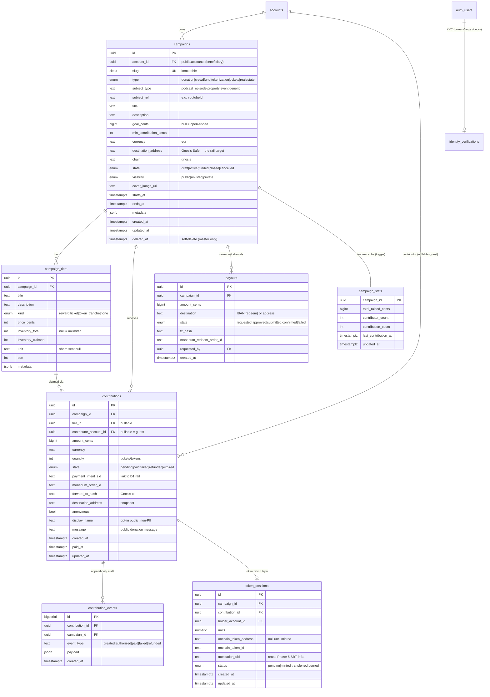

# pinka.finance — platform plan

> Status: **DRAFT plan** (2026-05-30). Onchain group-funding platform built on the
> existing Monerium → EURe → Gnosis rail (pay.domovina.ai) with the domain model in
> a new PostgreSQL schema `pinka_finance` inside this repo (domovina-api).
>
> MVP target: crowdfund / "tokenize" podcast episodes on domovina.ai.

## 0. One-paragraph thesis

Donations, real-estate raises, concert/match tickets, episode tokenization, and
generic crowdfunding are **the same data model**: a *campaign* (the thing being
funded) collects *contributions* (money in), optionally against a *tier*
(reward / ticket / token tranche), optionally producing a *position* (what a
contributor now holds), and pays out via a *payout* (money out). We model it
**once**, generically, and let `campaign.type` + a polymorphic `subject` drive
the differences. The fiat→EURe→Gnosis rail already exists and already routes to
any destination address; pinka.finance is mostly a domain layer + UI on top of
shipped infrastructure.

## 1. What already exists (reuse, do not rebuild)

| Capability | Status | Location |
|---|---|---|
| Fiat → EURe → Gnosis rail: `POST /api/intents` takes **any** `target_address`, returns EPC QR + checkout URL + status polling | shipped | pay.domovina.ai `backend/src/intents/{api,db}.ts`, `migrations/0007_payment_intents.sql` |
| Routing EURe to any destination (Safe + Zodiac Roles `EUReForwarder`) | shipped | `backend/src/router/safe.ts` |
| Monerium webhook + idempotency (`order.updated`/`processed`, mark-paid-if-pending) | shipped | `backend/src/monerium/*` |
| On-chain payment indexing: `PaymentRegistry.record(sessionId, kind, recipient, …)` — `kind` already supports `"donation"` | shipped (optional) | `backend/contracts/PaymentRegistry.sol` |
| EPC / HUB3 QR generation (Revolut iOS compatible, 4× supersample) | shipped | `backend/src/intents/epc.ts` + Flutter QR know-how |
| Identity: `public.accounts`, `accounts_memberships` (owner/admin/member), passkeys, `identity_verifications` (encrypted OIB KYC) | shipped | domovina-api Supabase migrations |
| Audit seam: append-only `activity_events`; RLS helpers `is_account_member` / `has_role_on_account` | shipped | domovina-api |
| Podcast subject data: episodes are CDN JSON keyed by `youtubeId`; Flutter app + Supabase auth | shipped | domovina.ai |
| Brand + landing: Next.js 14, coral/teal, "0% fee · <10s · podcast donations", waitlist + Prisma | shipped | pinka-finance/landing |

**Genuinely new work:** (1) the `pinka_finance` schema; (2) a server-side
`pinka-contribute` function that creates a contribution and calls the rail;
(3) an **outbound webhook** from the pay worker back to domovina-api (already
designed in pay.domovina.ai `docs/product-vision/per-event-safe-rail.md`, not
yet shipped); (4) UI.

## 2. Architecture bridge (the one non-obvious part)

Rail state lives in **Cloudflare D1 (SQLite)** in pay.domovina.ai. Domain model
lives in **Postgres (Supabase)** in domovina-api. Keep them separate — the rail
stays generic payment infrastructure. They connect through **one `sid` and one
webhook**:

```
Frontend (pinka.finance / domovina.ai widget)
   │  authenticated Supabase JWT
   ▼
domovina-api  Edge Function  pinka-contribute
   │  1. INSERT pinka_finance.contributions (state=pending)
   │  2. POST pay-worker /api/intents
   │        { target_address: campaign.destination_address,
   │          amount_eur, label,
   │          metadata: { campaign_id, contribution_id } }
   │  3. store returned sid + epc_qr_data on the contribution row
   ▼
contributor pays SEPA ──► Monerium mints EURe ──► pay-worker forwards to campaign Safe
   │
   ▼  pay-worker fires OUTBOUND webhook (HMAC, Standard-Webhooks)  ◄── NEW
domovina-api  Edge Function  pinka-webhook
   │  lookup contribution by sid → mark paid, store forward_tx_hash
   │  emit contribution.paid event, bump campaign_stats,
   │  (tokenization) create token_position
   ▼
Frontend updates via Supabase Realtime / poll
```

Frontend never calls the pay worker directly — domovina-api owns intent creation
so the `contribution ↔ sid` link is trusted and unforgeable.

## 3. The `pinka_finance` schema

House rules honoured (per domovina-api conventions):
- **PII only in `auth.users`** — pinka tables hold FK + non-PII; `display_name`/`message` are opt-in public strings.
- **Immutable slug** on `campaigns` (citext, BEFORE UPDATE guard).
- **Soft-delete on the master only** (`campaigns.deleted_at`); children hard-delete CASCADE.
- **Append-only audit** in `contribution_events` (bigserial), mirroring `activity_events`.
- **`amount_cents` integers**; decimals only at the rail boundary.
- **RLS** via `is_account_member` / `has_role_on_account`; service-role RPC for the webhook.

### ER diagram



### Enums

`pinka_finance.campaign_type` · `campaign_state` · `campaign_visibility` ·
`tier_kind` · `contribution_state` · `position_status` · `payout_state`.

### RLS sketch

- `campaigns`: public read where `visibility='public' AND state IN ('active','funded','closed') AND deleted_at IS NULL`; full access where `is_account_member(account_id)`.
- `contributions`: contributor reads own (`contributor_account_id = auth.uid()`'s account); campaign owner reads all for owned campaigns; public reads only the opt-in `display_name`/`message`/`amount` via a view or `campaign_stats`.
- `contribution_events`, `token_positions`, `payouts`: owner + service_role.
- Webhook path uses a `security definer` RPC `pinka_mark_contribution_paid(sid, tx_hash, …)` callable only by service_role.

### Server RPCs / functions

- `pinka_contribute(campaign_id, amount_cents, tier_id?, display_name?, message?, anonymous?)` — INSERT contribution, return its id (intent creation done by the Edge Function, server-to-server).
- `pinka_mark_contribution_paid(sid, forward_tx_hash, amount_received_cents)` — service_role; idempotent (only if `state='pending'`); emits event, bumps `campaign_stats`, creates `token_positions` if campaign is tokenization-type.
- Trigger on `contributions` paid → maintain `campaign_stats` + flip `campaigns.state` to `funded` when `goal_cents` reached.

## 4. Frontend: two surfaces, one backend

1. **pinka.finance** (Next.js — extend the existing landing repo). Primary product:
   - Public campaign pages `/c/{slug}` (progress bar, contributor wall, tiers).
   - Creator dashboard: campaign CRUD, tiers, live stats, payouts.
   - Checkout: render `epc_qr_data` + amount picker + status poll.
   - Matches landing roadmap (Q4 2026 self-serve onboarding).
2. **domovina.ai** (Flutter — the MVP surface). "Podrži ovu epizodu" panel on the
   episode screen:
   - Calls `domovina-api/pinka-contribute`, gets `epc_qr_data`, **renders QR
     natively** (reuse the EPC/HUB3 supersample know-how) → works on web + iOS +
     Android + TV, avoids the web-only iframe limit.
   - Campaign for an episode is auto-keyed by `subject_type='podcast_episode'`,
     `subject_ref = youtubeId`.
   - Brand stays domovina navy/red here; pinka coral/teal on pinka.finance.

## 5. Tokenization stance (important — legal)

For MVP, "tokenize an episode" = **soft tokenization**: a contributor gets a
recorded `token_position` + an optional passkey-signed on-chain **attestation/SBT**
(reuse the Phase-5 attestation infra) + public credit + reward tiers. This is a
*receipt of support*, not a transferable security.

**Real** fractional/tradeable tokens (revenue share, secondary market) trigger
MiCA / securities-prospectus obligations and the MiCA "no yield to EMT holders"
constraint already noted in project memory. Defer to Phase 4 behind legal
structuring. The schema supports both — `token_positions.onchain_token_address`
is null until/unless real minting happens.

## 6. Phasing

- **Phase 0 — Schema.** `pinka_finance` migrations here (tables, enums, RLS, `pinka_contribute` / `pinka_mark_contribution_paid` RPCs, stats trigger). No UI.
- **Phase 1 — MVP: podcast donations.** Outbound webhook on the pay worker; `pinka-contribute` + `pinka-webhook` Edge Functions; Flutter "support this episode" widget; minimal public campaign page. **Donation type only.**
- **Phase 2 — pinka.finance app.** Creator dashboard + public campaign pages + reward tiers (Next.js).
- **Phase 3 — Tokenization + tickets.** `token_positions` + attestation SBT as soft token; tickets as `tier.kind='ticket'` with QR ticket issuance.
- **Phase 4 — Real-estate / large raises.** KYC gating via `identity_verifications`; payout policy tiers (auto ≤€100 / multisig-propose €100–€1000 / out-of-band >€1000, per pay.domovina.ai `safe-tx/PHASE-2-SAFE-API.md`); only here the legal question of real transferable tokens.

## 7. Open decisions (resolve before Phase 0)

1. **Destination Safe per campaign vs shared rail Safe.** Per-campaign Safe = clean custody + creator self-withdrawal (matches landing's "100% to creator, on-chain treasury"); needs a Safe-factory step at campaign creation. Shared rail Safe + internal ledger = simpler, but pinka custodies. *Recommend per-campaign Safe* to match the landing promise.
2. **Tokenization MVP depth** — soft attestation (recommended) vs real tokens (defer).
3. **domovina.ai embed** — native Flutter QR (recommended, cross-platform) vs iframe to pinka checkout (web-only).
