# On-chain Donation Receipts & Tokenization — Design Plan

> Status: **DRAFT for iteration** (2026-06-05). No implementation yet — this is the systematic plan to review before we build.
> Scope: how a contributor to a Pinka campaign gets a verifiable **on-chain proof of contribution**, for both **SEPA** (off-chain payment) and **direct on-chain EURe** donations; whether that proof can become a **tradeable security token**; and how a **secondary market with royalties** could work.
>
> Related SSOT: [`pinka-finance-platform-plan.md`](./pinka-finance-platform-plan.md) · rails: [`pinka-donation-rails.md`](./pinka-donation-rails.md) · payouts: [`pinka-payout-execution.md`](./pinka-payout-execution.md) · contracts: `pinka-finance-mvp/` (Foundry).

---

## 1. TL;DR — the one decision that drives everything

A "proof of donation" can be **anything from a signed receipt to a financial instrument**. The single most important choice is *what rights the artifact conveys to the holder*, because that — not the file format — decides the legal regime, whether it can be traded, and whether royalties are even allowed.

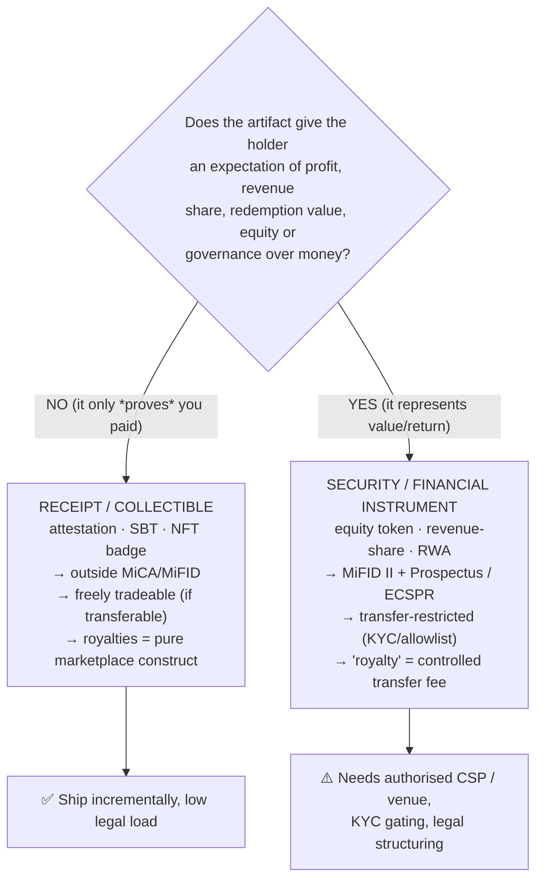

**Recommendation up front:** treat these as a **spectrum (Tiers 0→4)** and ship left-to-right. The donation product wants Tiers 1–3 (receipts/collectibles). The *equity* product (`pinka-finance-mvp` / ITALK) is Tier 4 and is a **separate regulated track** that should not be conflated with "donation receipts".

---

## 2. Where we are today (anchored to the code)

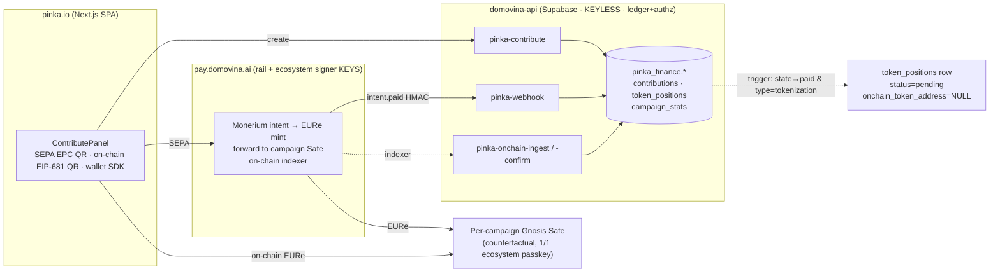

**Facts that constrain the design:**

| Fact | Implication for this plan |
|---|---|
| `token_positions` row is auto-created on `paid` **only when `campaign.type='tokenization'`**; `onchain_token_address` / `attestation_uid` stay **NULL** (dormant). | The ledger hook already exists — we extend it, we don't invent it. |
| **domovina-api holds no signing keys.** Minting/attesting must be triggered through **pay.domovina.ai** (ecosystem signer) or **client passkey** — same trust boundary as payouts. | Issuance is an *executive* action on the pay side; the API stays authz/ledger. |
| Per-campaign Safe is **counterfactual** (not deployed until first payout), 1/1 ecosystem signer; creator only *requests*. | The Safe can be the **issuer/owner** of receipt contracts, but only via the ecosystem signer; "Safe auto-issues" = ecosystem signer executes a Safe tx (or a Safe module). |
| `contributions` has idempotency keys (`payment_intent_sid`; `(forward_tx_hash, onchain_log_index)`) and `contributor_verified` (Certilia KYC snapshot) + `contributor_account_id`. | We get **dedup, KYC status, and identity linkage for free** — critical for both claims and security-token allowlisting. |
| Separate `pinka-finance-mvp` contracts already implement a **compliant ERC-20 equity** (allowlist bitmask, mint allowance, SEPA `investOnBehalf`, Safe `investFor`). **No NFT / no EAS / no EIP-2981.** | Tier 4 already has a code base; Tiers 1–3 (NFT/attestation/royalty) are net-new but small. |
| EURe is a **MiCA e-money token (EMT)** → **no interest/yield to holders** allowed. | Receipts must not promise yield; revenue-share belongs to Tier 4 structuring, not to a "receipt". |

---

## 3. The Receipt→Security spectrum (Tiers 0–4)

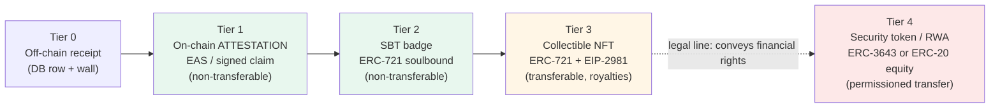

| Tier | Artifact | Transferable? | Conveys value? | Regime | Effort | Good for |
|---|---|---|---|---|---|---|
| **0** | DB receipt + support wall (✅ exists) | n/a | no | none | — | every donation |
| **1** | **EAS attestation** "address X contributed €Y to campaign Z @ t" | no (attestation) | no | none (proof) | **S** | verifiable donor proof, tax/audit trail, SEPA *and* on-chain |
| **2** | **Soulbound NFT** (ERC-721, transfer-locked) — supporter badge | no | no | none (collectible) | **M** | gamified supporter identity, POAP-style |
| **3** | **Collectible NFT** (ERC-721 + ERC-2981 royalty) — campaign art/edition | yes | no (utility/collectible) | outside MiCA/MiFID* | **M** | tradeable memorabilia, creator upside via royalties |
| **4** | **Security/RWA token** (equity, revenue-share, redeemable) | restricted | **yes** | MiFID II + Prospectus / **ECSPR** + KYC | **XL** | real fractional investment (the ITALK model) |

\* NFTs that are genuinely unique/collectible are outside MiCA; but a *large fungible series sold for expected profit* can be re-characterised as a security regardless of the ERC-721 wrapper (substance over form). See §4.

**Design stance:** the **"on-chain proof of donation"** the user is asking for is **Tier 1 (attestation)** as the universal default, optionally upgraded to **Tier 2/3** per campaign. **Tier 4 stays a separate, opt-in "investment campaign" product**, reusing `pinka-finance-mvp`.

---

## 4. Legal compass (EU / Croatia) — what makes it a security

This is a design input, **not legal advice**; every Tier-3/4 decision needs counsel sign-off.

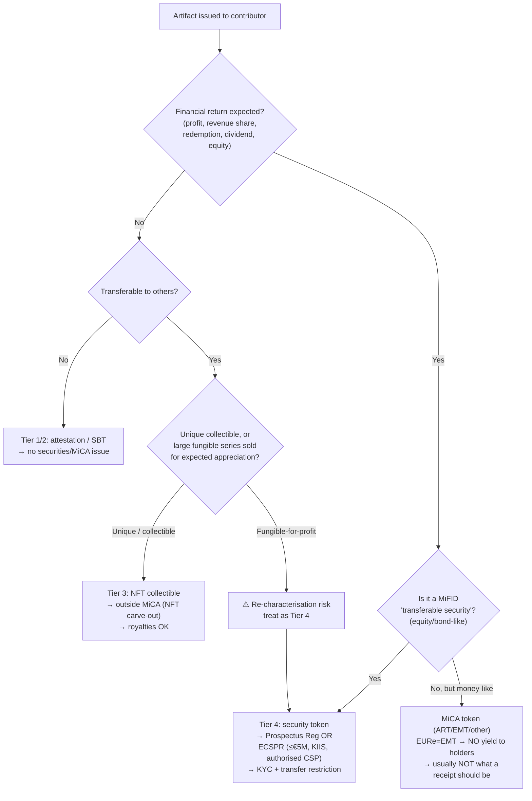

Key anchors:
- **MiCA (EU 2023/1114):** governs crypto-assets that are *not* financial instruments. EURe = **EMT → no interest/yield to holders** (don't promise donors yield). Genuinely unique **NFTs are carved out**; fractionalised/large series are not.
- **MiFID II + Prospectus Regulation:** equity/debt-like tokens are **transferable securities**. Public offer ⇒ prospectus unless exempt.
- **ECSPR (EU 2020/1503):** the realistic path for **equity/loan crowdfunding ≤ €5M / 12 mo** via an **authorised Crowdfunding Service Provider**, using a **Key Investment Information Sheet** instead of a full prospectus. ECSPR allows only a **bulletin board** (expressions of interest), **not** a real exchange.
- **DLT Pilot Regime (EU 2022/858):** the only sanctioned route to a *real* secondary **market** (MTF/settlement) for security tokens — heavyweight, licensed venues.
- **HANFA (HR regulator):** national competent authority for prospectus/ECSPR/MiFID in Croatia.

**Consequence for "secondary market with royalties":**
- Tier 3 (collectible) → trade anywhere, royalties are a contract/marketplace feature. ✅ feasible now.
- Tier 4 (security) → secondary trading is **permissioned and venue-restricted**; a "royalty" can only be a **protocol transfer fee** enforced by the compliant transfer hook, and resale needs an ECSPR bulletin board or a licensed venue. ⚠️ heavy.

---

## 5. Issuance architecture

### 5.1 Who is allowed to mint/attest? (the keyless-backend problem)

domovina-api cannot sign. Options, in order of preference:

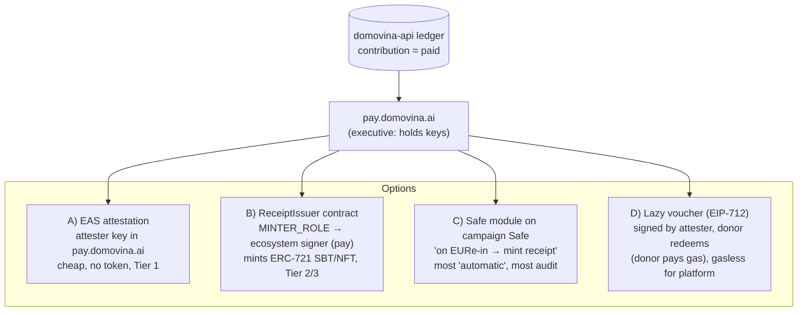

| Option | Mechanism | Pros | Cons | Fits tier |
|---|---|---|---|---|
| **A. EAS attester** | pay-side key signs an EAS attestation referencing `contribution_id`/donor address | cheapest, no NFT infra, revocable, great audit | not a "token" in wallets/markets | 1 |
| **B. ReceiptIssuer (mint on confirm)** | indexer/webhook → pay executes `mint(to, campaignId, …)` | real NFT in wallet, simple | platform pays gas; needs `to` address | 2,3 |
| **C. Safe module** | per-campaign Safe auto-mints on EURe-in | maximally "the Safe issues it", on-chain provenance | per-Safe module deploy, more complex, still needs `to` | 2,3 |
| **D. Lazy voucher** | pay signs EIP-712 voucher; donor calls `claim()` & pays gas | gasless for platform, donor opts in, perfect for SEPA | needs a claim UX; unclaimed vouchers expire | 1,2,3 |

**Recommendation:** **A + D**. Use **EAS attestations** as the universal Tier-1 proof (works even if donor has no wallet — attest to a derived/placeholder subject and re-point on claim), and **lazy EIP-712 vouchers** for Tier-2/3 tokens so the platform never custodies gas or guesses addresses. Reserve **C (Safe module)** for campaigns that want fully autonomous on-chain issuance.

> Note: confirm **EAS is deployed on Gnosis** (schema registry + attester); if not, fall back to a minimal `AttestationRegistry` contract or off-chain EIP-712 attestations verified on demand.

### 5.2 SEPA path — off-chain payment, on-chain *claim*

The donor pays by bank; they may have **no wallet**. So issuance is a **two-step claim**: the platform records an entitlement when EURe is confirmed, the donor later **claims** the on-chain artifact to their address.

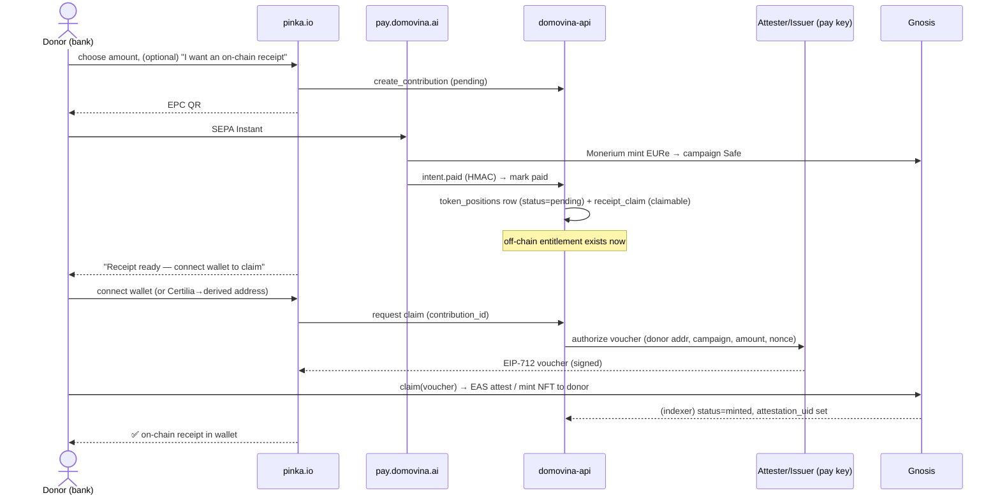

Design notes:
- The **entitlement** (`receipt_claim`) is created at `paid`; the **on-chain artifact** is created at `claim`. Unclaimed entitlements are still provable off-chain (Tier 0) and can carry an **EAS attestation to a placeholder/Certilia-derived subject** so a proof exists even pre-claim.
- If the donor is **Certilia-verified**, we can bind the receipt to their verified identity (KYC) — needed if the campaign is Tier-4.

### 5.3 Direct on-chain path — auto-issue to the sender

Here the donor's address **is known** (the `from` of the EURe `Transfer`). We can **auto-issue** without a claim step.

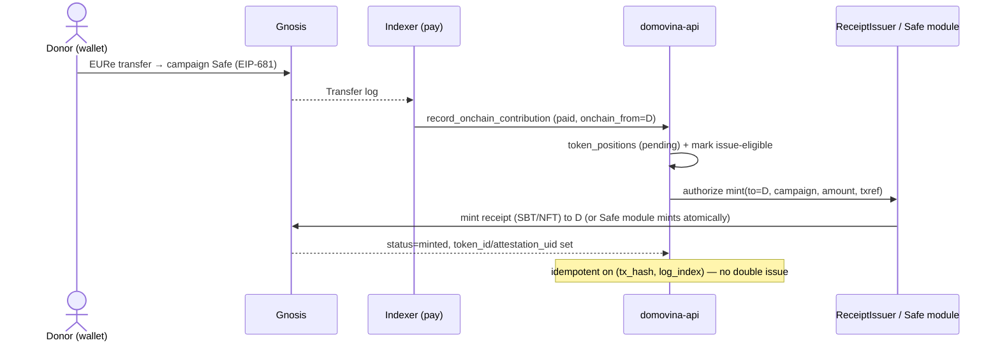

Design notes:
- This is the **"Safe multisig automatically issues a substitute token"** the user described. Two flavours: (B) pay-triggered `ReceiptIssuer.mint`, or (C) a **Zodiac-style Safe module** that mints atomically on EURe-in. Start with B; graduate to C for campaigns that want trustless autonomy.
- **One receipt per Transfer log** (reuse the existing `(forward_tx_hash, onchain_log_index)` idempotency key).

---

## 6. Token-standard mapping & contracts

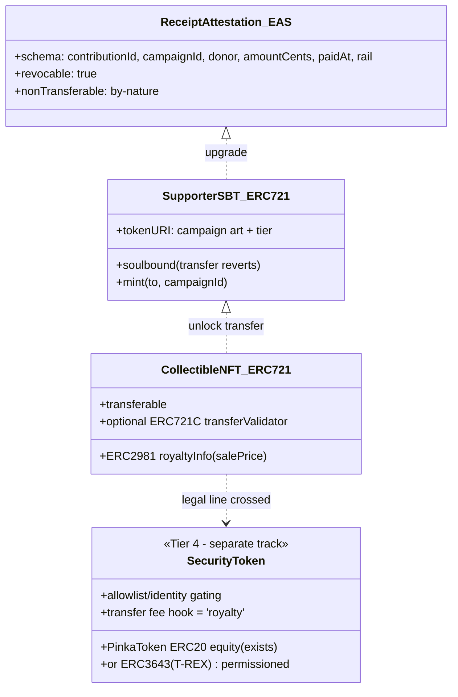

- **Tier 1:** EAS schema (no new token contract).
- **Tier 2:** one **`PinkaReceipt721`** with a soulbound switch (transfers revert unless `TRANSFERER_ROLE`) — mirrors the allowlist/role pattern already used in `PinkaToken`.
- **Tier 3:** same contract with transfers enabled + **ERC-2981**; add **ERC-721C** validator only if royalty enforcement matters (see §7).
- **Tier 4:** reuse **`pinka-finance-mvp` (`PinkaToken`/`PinkaFactory`)** or migrate to **ERC-3643 (T-REX)** for standardised identity/transfer compliance. This is where ITALK lives.

---

## 7. Secondary market & royalties

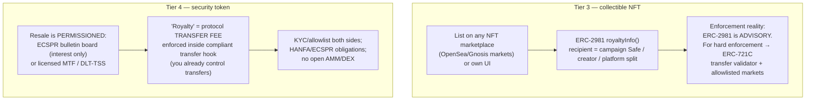

**Answering the user's question directly:**

- *"Does the on-chain proof become a security the user can trade?"* — **Only if you make it one.** A receipt/attestation/SBT (Tiers 1–2) is **not** tradeable by design. A collectible NFT (Tier 3) is freely tradeable but is **not a security** as long as it conveys **no financial return** — it's memorabilia. It becomes a **security (Tier 4)** the moment it carries revenue-share/equity/redemption; then trading is **restricted** to permissioned/licensed venues.

- *"How to set up a secondary market with royalties?"*
  - **Collectible route (recommended first):** mint Tier-3 NFTs, set **ERC-2981** royalty (e.g., split: creator X% / campaign Safe Y% / platform Z%), optionally **ERC-721C** for enforcement, and either list on existing markets or run a thin in-app order book. Royalties flow on-chain in EURe/xDAI on each sale. **No securities licence needed.**
  - **Security route:** royalties become a **transfer fee** inside the compliant transfer function; resale happens on an **ECSPR bulletin board** (matching, not executing) or a **licensed MTF**. Requires authorised CSP/venue, KYC on both sides, and counsel. **Do not** expose Tier-4 tokens to open DEX/AMM liquidity.

---

## 8. Data-model changes

Extend the existing schema rather than replace it.

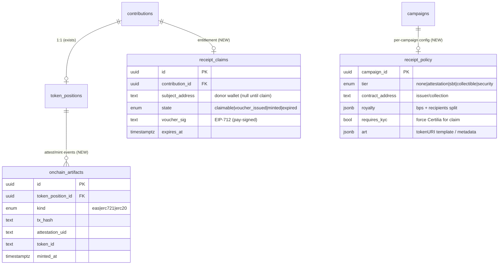

Reuse: `token_positions` (status `pending→minted→transferred→burned`), `contributions.contributor_verified` (KYC gate for Tier-4 claims), existing idempotency keys.

---

## 9. Receipt lifecycle (state machine)

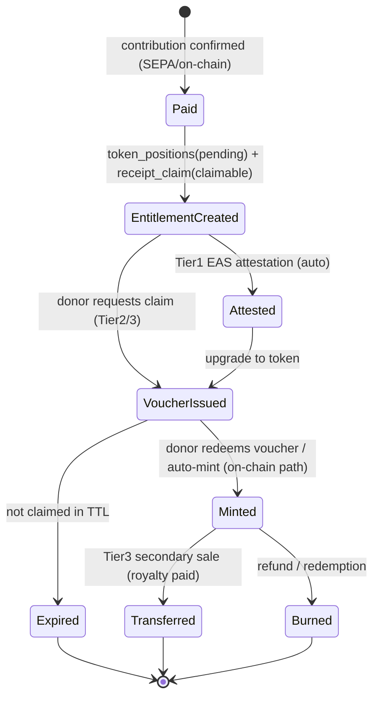

---

## 10. Phased roadmap

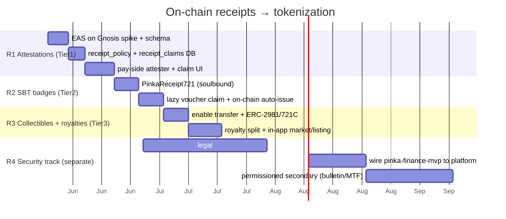

**R1** delivers the user's core ask (on-chain proof for SEPA *and* on-chain donations) with the least legal load. **R2–R3** add wallet-visible tokens and a royalty-bearing collectible market. **R4** is the regulated investment product, gated behind legal work, reusing the existing equity contracts.

---

## 11. Open decisions (to iterate before building)

1. **Default receipt tier** — should *every* paid donation get a Tier-1 EAS attestation automatically, or only when the donor opts in / the campaign enables it?
2. **Claim model** — lazy voucher (donor pays gas, opt-in) vs platform-paid auto-mint vs Certilia-derived custodial address for wallet-less donors? (Recommendation: lazy voucher + EAS-to-Certilia-subject fallback.)
3. **EAS vs custom registry** — is EAS live on Gnosis with an attester we can run, or do we ship a minimal `AttestationRegistry`?
4. **Issuer identity** — receipts minted by a **platform-wide** collection or a **per-campaign** Safe/collection? (Per-campaign = cleaner provenance, more deploys.)
5. **Royalty policy (Tier 3)** — split between creator / campaign Safe / platform, and do we need **hard enforcement** (ERC-721C) or is ERC-2981 advisory enough?
6. **Tier-4 appetite** — do we actually want to run regulated equity crowdfunding now (ECSPR/CSP partner), or keep `pinka-finance-mvp` as a separate pilot (ITALK) and *not* expose donation receipts as securities?
7. **KYC binding** — bind every receipt to Certilia identity, or only Tier-4? (Privacy vs compliance trade-off.)

---

## 12. Risks & non-goals

- **Re-characterisation risk:** marketing a Tier-3 collectible with "it'll be worth more / you get a cut" turns it into a Tier-4 security. Keep receipt messaging strictly *proof-of-support*.
- **EMT yield ban:** never present held-EURe yield as a donor benefit.
- **Royalty enforceability:** ERC-2981 is honoured only by cooperating markets; set expectations or use ERC-721C.
- **Key surface:** any new attester/minter key expands the pay-side trust boundary — scope it tightly (mint-only role, per-campaign caps), mirroring the existing payout signer model.
- **Non-goals (for now):** open DEX/AMM liquidity for any Pinka token; promising returns on donations; cross-chain receipts (Gnosis-only to match EURe).
```
